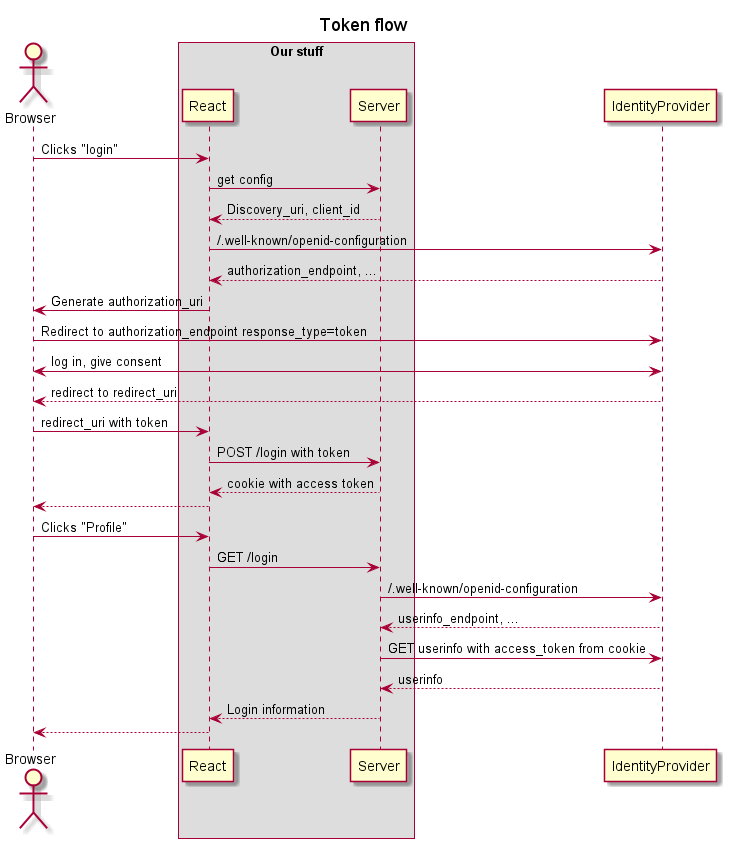
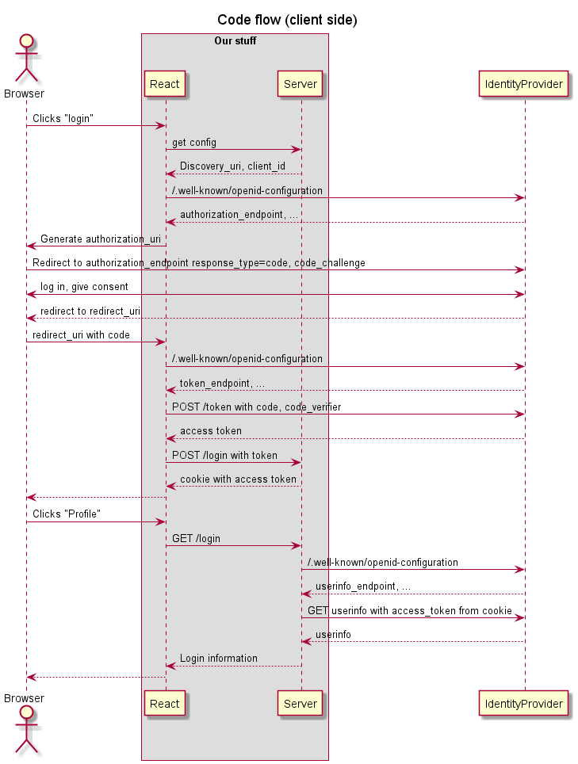

# OpenID Connect - log on with Google

TOKEN FLOW (`response_type: "token"`)

[Deployed on Heroku](https://pg6301-8.herokuapp.com)

* [x] Create Express + React project (https://github.com/kristiania-pg6301*-*2022/pg6301-react-and-express-lectures#quickly-creating-a-express--react-application)
* [x] Create server.js and index.html
* [x] Routes: FrontPage, Login, LoginCallback, Profile
* [x] Deploy to Heroku (https://github.com/kristiania-pg6301-2022/pg6301-react-and-express-lectures#deploy-to-heroku)
* [x] Redirect user to authorization url
* [x] Application registration in Google Developer Console
* [x] Pick up token from callback redirect
* [x] Save token in cookie
* [x] Fetch user information from userinfo call with token
* [ ] Move configuration to server
* [ ] Log out?
* [ ] Set user on Context

# Lecture 11: OpenID connect with code flow

CODE FLOW (`response_type: "code"`)

* [ ] Demonstrate setting up of working application with Active Directory (PAY ATTENTION - NO COMMITS)
* [ ] Review code from lecture 8
* [ ] Fix issues from lecture 8
  * [ ] Move configuration to server
  * [ ] Set user on Context
* [ ] Change to use ID-porten as identity provider
  * [ ] Update discovery endpoing
  * [ ] Update response_type=code and response_mode=fragment
  * [ ] Generate code_challenge
  * [ ] Handle callback
  * [ ] Fetch token
